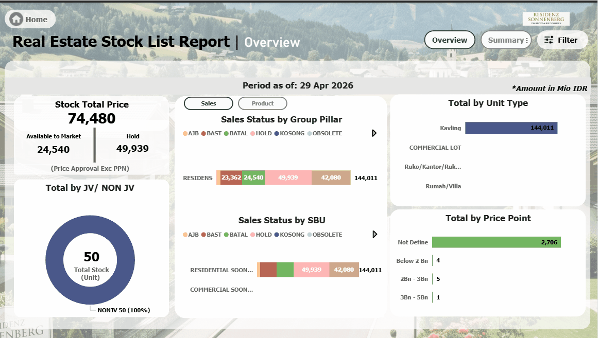

# Power_BI_Project_Real_Estate_Stock_Report

## Project Overview
This project is a comprehensive Real Estate Inventory Management Dashboard designed to provide stakeholders with end-to-end visibility into stock health, sales performance, and construction progress. It transforms complex raw data into actionable insights for high-level decision-making.

Note: This dashboard utilizes a creative dummy dataset with location names inspired by One Piece (e.g., Alabasta, Dressrosa, Marineford) to demonstrate professional BI capabilities within a unique, portfolio-friendly context.

## Dashboard Previews


### 1. Interactive Landing Page
A clean entry point featuring a modular navigation system for seamless access to different report levels.


### 2. Executive Overview
Focuses on high-level KPIs: Stock Total Price (Mio IDR), Available vs. Hold units, and Price Point distribution.


### 3. Inventory Summary & MoM Analysis
A detailed hierarchical view comparing Month-over-Month (MoM) stock status (Under Construction, Ready Stock, Not Assigned) with automated deviation tracking.


### 4. Advanced Filtering System
A dedicated, pop-out filter panel designed using bookmarks and selection panes to maintain a clutter-free user experience.


## Technical Highlights
### Data Modeling
- **Architecture**: Implemented a Star Schema to optimize query performance and ensure data integrity.

- **Granularity**: Data flows from Group Pillar and SBU levels down to specific Unit IDs.

- **Dataset Design**: Historical dataset with **SCD Type 2** for:
  - Accurate historical tracking
  - Fast incremental processing
  - Point-in-time analysis

### DAX Engineering
- **Time Intelligence**:
  1. Custom DAX measures to make sure that when usser open the report then they will directly see today data.
  2. DAX measure to calculate historical data that have Accurate historical tracking and Fast incremental processing adapt with scd type 2 dataset.
  
```DAX
ST Hold Total Price = 
VAR CurrentSelection =
    SELECTEDVALUE ( Stock_History_Daily[StockStatusDesc], "STOCK" )
VAR currentPeriodmin =
    MIN ( Date_table[Date] )
VAR SelectedDatecal =
    CALCULATE (
        SUM ( Stock_History_Daily[PriceApproval] ),
        Stock_History_Daily[ValidFrom] <= currentPeriodmin,
        Stock_History_Daily[ValidTo] >= CurrentPeriodmin,
        Stock_History_Daily[StockStatusDesc] = CurrentSelection,
        KEEPFILTERS ( Stock_History_Daily[SalesStatusDesc] = "HOLD" )
    )
VAR SelectedDatecal2 =
    IF (
        CurrentSelection = "STOCK",
        IF ( ISBLANK ( SelectedDatecal ), "0", SelectedDatecal ),
        "0"
    )
VAR Todaycal =
    CALCULATE (
        SUM ( Stock_History_Daily[PriceApproval] ),
        Stock_History_Daily[ValidFrom] <= TODAY (),
        Stock_History_Daily[ValidTo] >= TODAY (),
        Stock_History_Daily[StockStatusDesc] = CurrentSelection,
        KEEPFILTERS ( Stock_History_Daily[SalesStatusDesc] = "HOLD" )
    )
VAR Todaycal2 =
    IF (
        CurrentSelection = "STOCK",
        IF ( ISBLANK ( Todaycal ), "0", Todaycal ),
        "0"
    )
VAR anytimecal =
    IF ( ISFILTERED ( Date_table[Date] ), SelectedDatecal2, Todaycal2 )
RETURN
    anytimecal
```

## Deep Dive: Dynamic MoM Analysis Engine (ST MoM Analysis)
One of the core technical challenges in this project was creating a highly performant, dynamic Matrix report that handles multiple metrics (Amount vs. Count), time periods, and "As-Of" snapshot logic simultaneously.

Instead of creating dozens of separate measures, I developed a single Universal Measure utilizing a "Helper Table" pattern and SCD (Slowly Changing Dimension) Type 2 logic.

Key Technical Features:
SCD Type 2 & Point-in-Time Logic: The measure uses a ValidFrom and ValidTo logic to calculate the stock status at any specific point in time. It determines whether a record was "active" by checking:
Stock_History_Daily[ValidFrom] <= SelectedDate && Stock_History_Daily[ValidTo] >= SelectedDate
This allows for accurate historical snapshots of real estate inventory.

Dynamic Metric Toggling: Using a header3 variable, the engine automatically switches between:

Financials: Sum of PriceApproval (converted to Millions/Mio IDR).

Inventory Volume: Distinct Count of material units.

Smart Deviation Logic: The IsTotalMetrics variable acts as a logic gate. When calculating "Deviation," the engine knows when to bypass specific status filters to ensure a consistent baseline for comparison between the current and previous months.

Hybrid Time Context: The measure includes a built-in safety mechanism using ISFILTERED.

If a user selects a date on the slicer, the report shows Historical Snapshots.

If no date is selected, it defaults to a Real-Time View based on TODAY().

Context-Aware Formatting (ISINSCOPE): To ensure a clean UI, the measure uses ISINSCOPE to only display "Launching Date" metadata at the specific Cluster level, preventing data clutter at the aggregate/total levels.

```dax
ST MoM Analysis = 
VAR header1 =
    SELECTEDVALUE ( 'Helper for MOM 4'[-] )
VAR header2 =
    SELECTEDVALUE ( 'Helper for MOM 4'[- ] )
VAR header3 =
    SELECTEDVALUE ( 'Helper for MOM 4'[Header 3] )
VAR CurrentPeriod =
    SELECTEDVALUE ( Date_table[end of month] )
VAR PrevPeriod =
    SELECTEDVALUE ( Date_table[end of month before] )
VAR CurrentPeriodmin =
    EDATE ( DATE ( YEAR ( MIN ( Date_table[Date] ) ), MONTH ( MIN ( Date_table[Date] ) ), 1 ), 1 ) - 1
VAR PrevPeriodmin =
    DATE ( YEAR ( MIN ( Date_table[Date] ) ), MONTH ( MIN ( Date_table[Date] ) ), 1 ) - 1
VAR CurrentPeriodmax =
    MAX ( Date_table[end of month] )
VAR PrevPeriodmax =
    MAX ( Date_table[end of month before] )
VAR InMio = 1000000
VAR RealStatus = header2
VAR IsTotalMetrics = ( header1 = "Deviation" ) -- 3. CORE CALCULATION
VAR Val_Current =
    CALCULATE (
        IF (
            header3 = "Amount",
            SUM ( Stock_History_Daily[PriceApproval] ) / InMio,
            distinctCOUNT ( Stock_History_Daily[materianno&company] )
        ),
        Stock_History_Daily[ValidFrom] <= CurrentPeriodmin,
        Stock_History_Daily[ValidTo] >= CurrentPeriodmin,
        -- LOGIC BARU:
        -- Jika ini Deviation (IsTotalMetrics = TRUE), maka kondisi jadi TRUE (ambil semua data/Total).
        -- Jika BUKAN Deviation, baru dia filter berdasarkan Status.
        IsTotalMetrics
            || Stock_History_Daily[ConstructionStatusDesc] = RealStatus
    )
VAR Val_Prev =
    CALCULATE (
        IF (
            header3 = "Amount",
            SUM ( Stock_History_Daily[PriceApproval] ) / InMio,
            distinctCOUNT ( Stock_History_Daily[materianno&company] )
        ),
        Stock_History_Daily[ValidFrom] <= PrevPeriodmin,
        Stock_History_Daily[ValidTo] >= PrevPeriodmin,
        IsTotalMetrics
            || Stock_History_Daily[ConstructionStatusDesc] = RealStatus
    )
VAR todaymonthperiod =
    EDATE ( DATE ( YEAR ( TODAY () ), MONTH ( TODAY () ), 1 ), 1 ) - 1
VAR todaypreviousmonthperiod =
    DATE ( YEAR ( TODAY () ), MONTH ( TODAY () ), 1 ) - 1
VAR todayVal_Current =
    CALCULATE (
        IF (
            header3 = "Amount",
            SUM ( Stock_History_Daily[PriceApproval] ) / InMio,
            distinctCOUNT ( Stock_History_Daily[materianno&company] )
        ),
        Stock_History_Daily[ValidFrom] <= todaymonthperiod,
        Stock_History_Daily[ValidTo] >= todaymonthperiod,
        -- LOGIC BARU:
        -- Jika ini Deviation (IsTotalMetrics = TRUE), maka kondisi jadi TRUE (ambil semua data/Total).
        -- Jika BUKAN Deviation, baru dia filter berdasarkan Status.
        IsTotalMetrics
            || Stock_History_Daily[ConstructionStatusDesc] = RealStatus
    )
VAR today_Val_Prev =
    CALCULATE (
        IF (
            header3 = "Amount",
            SUM ( Stock_History_Daily[PriceApproval] ) / InMio,
            distinctCOUNT ( Stock_History_Daily[materianno&company] )
        ),
        Stock_History_Daily[ValidFrom] <= todaypreviousmonthperiod,
        Stock_History_Daily[ValidTo] >= todaypreviousmonthperiod,
        IsTotalMetrics
            || Stock_History_Daily[ConstructionStatusDesc] = RealStatus
    )
VAR selecteddatecal =
    SWITCH (
        header1,
        "As Of Month", Val_Current,
        "As Of Month Before", Val_Prev,
        "Deviation", Val_Current - Val_Prev,
        -- Sekarang Val_Current isinya sudah Total, jadi aman.
        "Launching Date",
            IF (
                ISINSCOPE ( Stock_History_Daily[ClusterDesc] ),
                FORMAT ( MAX ( Stock_History_Daily[LaunchingDate] ), "dd mmm yyyy" ),
                BLANK ()
            )
    )
VAR todaydatecal =
    SWITCH (
        header1,
        "As Of Month", todayVal_Current,
        "As Of Month Before", today_Val_Prev,
        "Deviation", todayVal_Current - today_Val_Prev,
        -- Sekarang Val_Current isinya sudah Total, jadi aman.
        "Launching Date",
            IF (
                ISINSCOPE ( Stock_History_Daily[ClusterDesc] ),
                FORMAT ( MAX ( Stock_History_Daily[LaunchingDate] ), "dd mmm yyyy" ),
                BLANK ()
            )
    )
VAR anytimecal =
    IF ( ISFILTERED ( Date_table[Date] ), selecteddatecal, todaydatecal )
RETURN
    anytimecal
```

DAX Logic Breakdown:
Variables: Capture user selection from the Helper Table and Date Slicers.

Core Calculation (Val_Current / Val_Prev): Executes the filtered aggregation based on the validity period of the stock.

The Switchboard: A final SWITCH statement determines the final output (As of Month, Month Before, or the Variance/Deviation).

## UI/UX Design
- Navigation: Built-in buttons for "Cover", "Overview," "Summary," and "Detail" views.

- Scalability: The dashboard is designed to handle thousands of unit records while maintaining fast load times.
